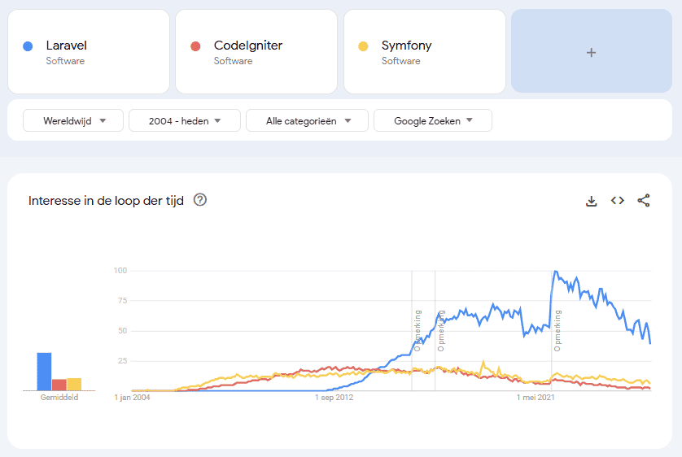

<!-- _class: lead -->

# Livewire v4 Fundamentals

<p class="subtitle">&lt;Full-Stack Reactivity for Modern Laravel Applications /&gt;</p>

<div class="meta-box">
  <strong>Thomas More Hogeschool</strong> - Toegepaste Informatica (ITF)<br>
  <strong>Vak:</strong> Web Development | <strong>Thema:</strong> Livewire v4 Componenten, Server Reactiviteit & SPA Navigatie
</div>

---

## Test images <span class="badge">Side-by-Side</span>

<div class="split-1-2">
  <div class="img-box">
    
    <p class="caption">Livewire v4 Diagram</p>
  </div>
  <div class="card card-accent">
    <h4>Overzicht & Functies</h4>
    <ul>
      <li>Eerste kernpunt met toelichting</li>
      <li>Tweede punt met richtlijnen</li>
      <li>Derde punt voor reactieve state</li>
      <li>Vierde punt met automatische morphing</li>
    </ul>
  </div>
</div>

---

## Inhoudsopgave

1. **Wat is Livewire v4?** - Filosofie, architectuur en hoe het onder de motorkap werkt
2. **Installatie & Snelle Start** - Setup in Laravel en componentcreatie
3. **Interactief Oefenen** - Quickstart documentatie en experimenteren
4. **Component Architectuur in v4** - Single-file componenten (`.blade.php`) vs klassieke klassen
5. **Properties & Two-Way Data Binding** - `wire:model`, `.live`, `.blur` en `mount()`
6. **Actions & Event Handling** - `wire:click`, `wire:submit`, parameters en modifiers
7. **Loading States & Feedback** - `wire:loading`, `wire:target` en actie-specifieke feedback
8. **Formulieren, Validatie & Form Objects** - `#[Validate]`, `Form` klassen en realtime fouten
9. **SPA Navigatie & Prestaties** - `wire:navigate` en `wire:navigate.hover`
10. **Alpine.js & JavaScript Integratie** - Het `$wire` object en hybride interacties
11. **Wat is er Nieuw in Livewire v4?** - Single-file standaard, snelle morphing en `#[Modelable]`
12. **Praktijkvoorbeeld** - Realtime Live Zoekfilter met paginering en CRUD

---

## Interactief Oefenen: Livewire v4 Docs <span class="badge">Online Documentatie</span>

Wil je de voorbeelden uit deze presentatie verdiepen of meteen uitproberen in je Laravel app?

Raadpleeg de officiële documentatie:
**[livewire.laravel.com/docs/4.x/quickstart](https://livewire.laravel.com/docs/4.x/quickstart)**

<div class="grid-2">
<div class="card">

#### Waarom Livewire in Laravel?

- **Bouw dynamische UIs:** Geen aparte REST/GraphQL API of zware JavaScript state libraries nodig
- **100% PHP & Blade:** Blijf binnen het vertrouwde Laravel ecosysteem (Eloquent, Auth, Validatie)
- **Directe serverkoppeling:** Wijzigingen synchroniseren automatisch via compacte JSON payloads

</div>
<div class="card">

#### Handig tijdens deze les

- Kopieer voorbeeldcode direct uit deze slides
- Bestudeer hoe server methodes rechtstreeks gekoppeld worden aan Blade knoppen
- Combineer Livewire met **Tailwind CSS** en **Alpine.js** voor de complete TALL-stack ervaring

</div>
</div>

---

## 1. Wat is Livewire v4?

Livewire is een **full-stack framework voor Laravel** waarmee je dynamische, reactieve interfaces bouwt met uitsluitend PHP en Blade:

```html
<?php
use Livewire\Component;

new class extends Component {
    public int $count = 0;

    public function increment(): void {
        $this->count++;
    }
};
?>

<div class="p-6 bg-slate-900 border border-slate-800 rounded-xl text-white">
    <h3 class="text-xl font-bold">Teller: <span class="text-orange-400">{{ $count }}</span></h3>
    <button wire:click="increment" class="mt-4 px-4 py-2 bg-orange-600 rounded font-bold">
        + Verhoog Teller
    </button>
</div>
```

---

## 1. Hoe werkt Livewire onder de motorkap?

Livewire transformeert een traditioneel verzoek naar een reactieve ervaring:

<div class="grid-2">
<div class="card">

#### De 4 Stappen van de Lifecycle

1. **Initial Render:** Livewire rendert de component op de server en stuurt pure HTML naar de browser
2. **User Interaction:** De gebruiker klikt op `wire:click` of typt in `wire:model`
3. **AJAX Payload:** Livewire stuurt een klein JSON verzoek naar de server met de gewijzigde toestand
4. **DOM Morphing:** De server herbouwt de Blade view; Livewire past **enkel de gewijzigde DOM elementen** aan via morphing

</div>
<div class="card">

#### Voordelen voor Developers

- **Geen API Duplicatie:** Je hoeft geen aparte controllers of JSON serialisers te schrijven
- **Volledige Beveiliging:** Autorisatie en validatie gebeuren direct op de server
- **SEO Vriendelijk:** Pagina's worden server-side gerenderd (SSR)

</div>
</div>

---

## 2. Installatie & Eerste Component

Installeer Livewire in een bestaand Laravel project via Composer:

```bash
# 1. Installeer Livewire via Composer
composer require livewire/livewire

# 2. Maak een nieuw Livewire component aan
php artisan make:livewire TaskList
```

Plaats het component in een willekeurige Blade template:

```html
<!-- In resources/views/dashboard.blade.php -->
<x-layouts.app>
    <h1 class="text-2xl font-bold mb-6">Mijn Taken</h1>

    <!-- Component insluiten via Blade tag -->
    <livewire:task-list />
</x-layouts.app>
```

---

## 4. Component Architectuur in v4: Single-File Componenten

In Livewire v4 zijn **Single-File Componenten** de standaard. PHP-klasse en Blade-template leven samen in één bestand:

```html
<?php // resources/views/components/todos.blade.php

use Livewire\Component;

new class extends Component {
    public array $todos = ['HTML5 Essentials', 'CSS3 Layouts'];
    public string $newTodo = '';

    public function addTodo(): void {
        if (!empty($this->newTodo)) {
            $this->todos[] = $this->newTodo;
            $this->reset('newTodo');
        }
    }
};
?>

<div>
    <div class="flex gap-2">
        <input type="text" wire:model="newTodo" placeholder="Nieuwe taak..." class="input">
        <button wire:click="addTodo" class="btn">Toevoegen</button>
    </div>
    <ul class="mt-4 space-y-2">
        @foreach($todos as $todo)
            <li wire:key="{{ $loop->index }}" class="p-2 bg-slate-800 rounded">{{ $todo }}</li>
        @endforeach
    </ul>
</div>
```

---

## 5. Properties & Two-Way Binding (`wire:model`)

Public properties op je Livewire component worden automatisch gekoppeld aan formuliervelden:

```html
<div class="space-y-4">
    <!-- 1. Standaard wire:model (synchroniseert bij actie/verzenden) -->
    <input type="text" wire:model="title" class="input" placeholder="Titel">

    <!-- 2. wire:model.live (realtime synchronisatie bij elke toetsaanslag) -->
    <input type="text" wire:model.live="search" class="input" placeholder="Live zoeken...">

    <!-- 3. wire:model.blur (synchroniseert zodra de gebruiker het veld verlaat) -->
    <input type="email" wire:model.blur="email" class="input" placeholder="E-mail">

    <!-- 4. wire:model.debounce.500ms (wacht 500ms na laatste toets) -->
    <input type="text" wire:model.live.debounce.500ms="query" class="input">
</div>
```

> **Lifecycle helpers:** Gebruik `$this->reset('property')` om een variabele te wissen en `mount()` om initiële parameters bij het inladen in te stellen.

---

## 6. Actions & Event Handling

Koppel gebruikersacties in de browser rechtstreeks aan PHP-methoden op de server:

```html
<div class="space-y-3">
    <!-- Eenvoudige klik actie -->
    <button wire:click="publish" class="btn">Publiceren</button>

    <!-- Actie met parameters doorgeven -->
    <button wire:click="deletePost({{ $post->id }})" class="btn-danger">Verwijderen</button>

    <!-- Formulier verzending (voorkomt automatisch pagina herladen) -->
    <form wire:submit="save">
        <input type="text" wire:model="name" required>
        <button type="submit">Opslaan</button>
    </form>

    <!-- Toetsaanslag modifiers -->
    <input type="text" wire:keydown.enter="save" wire:keydown.escape="cancel">
</div>
```

---

## 7. Loading States & Feedback (`wire:loading`)

Geef studenten en gebruikers directe feedback tijdens netwerkverzoeken naar de server:

```html
<form wire:submit="savePost">
    <input type="text" wire:model="title">

    <button type="submit" class="btn">
        <!-- Verberg tekst tijdens opslaan -->
        <span wire:loading.remove wire:target="savePost">Post Opslaan</span>
        <!-- Toon spinner tijdens opslaan -->
        <span wire:loading wire:target="savePost">Bezig met opslaan...</span>
    </button>

    <!-- Specifieke loading indicator -->
    <div wire:loading wire:target="savePost" class="text-sm text-orange-400 mt-2">
        Gegevens worden verwerkt op de server...
    </div>

    <!-- UI uitschakelen / dimmen tijdens laden -->
    <div wire:loading.class="opacity-50 pointer-events-none" wire:target="savePost">
        Inhoud die tijdelijk inactief wordt...
    </div>
</form>
```

---

## 8. Formulieren & Validatie in Livewire

Livewire biedt naadloze validatie met behulp van PHP Attributes:

```php
<?php
use Livewire\Attributes\Validate;
use Livewire\Component;
use App\Models\Article;

new class extends Component {
    #[Validate('required|min:3|max:100')]
    public string $title = '';

    #[Validate('required|min:10')]
    public string $content = '';

    public function save(): void {
        $this->validate();

        Article::create([
            'title' => $this->title,
            'content' => $this->content,
        ]);

        session()->flash('message', 'Artikel succesvol opgeslagen!');
        $this->reset();
    }
};
?>
```

---

## 8. Realtime Foutmeldingen Tonen in Blade

Toon validatiefouten direct onder de invoervelden met de vertrouwde `@error` directive:

```html
<form wire:submit="save" class="space-y-4">
    <div>
        <label class="block text-sm font-semibold">Titel</label>
        <input type="text" wire:model.blur="title" class="input w-full">
        @error('title')
            <p class="text-red-500 text-xs mt-1">{{ $message }}</p>
        @enderror
    </div>

    <div>
        <label class="block text-sm font-semibold">Inhoud</label>
        <textarea wire:model.blur="content" class="textarea w-full"></textarea>
        @error('content')
            <p class="text-red-500 text-xs mt-1">{{ $message }}</p>
        @enderror
    </div>

    <button type="submit" class="btn">Artikel Opslaan</button>
</form>
```

---

## 8. Geavanceerd: Dedicated Form Objects

Voor grote formulieren scheid je formulierlogica en validatie af in een herbruikbaar **Form Object**:

```php
<?php // app/Livewire/Forms/PostForm.php
namespace App\Livewire\Forms;

use Livewire\Form;
use Livewire\Attributes\Validate;

class PostForm extends Form {
    #[Validate('required|min:5')]
    public string $title = '';

    #[Validate('required|min:20')]
    public string $body = '';
}
```

```html
<?php // Component dat het Form Object gebruikt
use App\Livewire\Forms\PostForm;
use Livewire\Component;

new class extends Component {
    public PostForm $form;

    public function save(): void {
        $this->form->validate();
        // $this->form->title opslaan in database...
    }
};
?>
```

---

## 9. SPA Navigatie met `wire:navigate`

Maak van je Laravel applicatie een bliksemsnelle Single Page Application (SPA) zonder JavaScript router:

```html
<nav class="flex gap-4 p-4 bg-slate-900 border-b border-slate-800">
    <!-- wire:navigate haalt pagina's op via fetch en vervangt de DOM zonder volledige refresh -->
    <a href="/" wire:navigate class="text-white hover:text-orange-400">Dashboard</a>
    <a href="/courses" wire:navigate class="text-white hover:text-orange-400">Cursussen</a>

    <!-- wire:navigate.hover prefetcht de pagina zodra de gebruiker over de link hovert -->
    <a href="/profile" wire:navigate.hover class="text-white hover:text-orange-400">Mijn Profiel</a>
</nav>
```

<div class="grid-2">
<div class="card">

#### Wat doet `wire:navigate`?

- Voorkomt een wit knipperend scherm bij paginawissels
- Behoudt scrollpositie en hergebruikt reeds geladen scripts en stijlen
- Verwerkt browser geschiedenis (Back/Forward knoppen) naadloos

</div>
<div class="card">

#### Instant Preloading

- `wire:navigate.hover` laadt de HTML al op de achtergrond in zodra de muis de link nadert
- Resulteert in een **onmiddellijke (<10ms) navigatie** voor de eindgebruiker!

</div>
</div>

---

## 10. Alpine.js & JavaScript Integratie (`$wire`)

Livewire en Alpine.js werken perfect samen. In Alpine heb je direct toegang tot het `$wire` object:

```html
<div x-data="{ localCount: 0 }">
    <!-- Livewire property uitlezen in Alpine -->
    <p>Karakters in server model: <span x-text="$wire.content.length"></span></p>

    <!-- Server methode aanroepen vanuit JavaScript -->
    <button @click="$wire.save()" class="btn">
        Trigger Server Opslaan via JS
    </button>

    <!-- Tweeweg synchronisatie tussen client state en server state -->
    <input type="text" x-model="$wire.query" placeholder="Type..." class="input">
</div>
```

### Belangrijke `$wire` functies

- `$wire.get('prop')` & `$wire.set('prop', value)` - Eigenschappen lezen en muteren
- `$wire.call('methodName', ...params)` - PHP methodes aanroepen
- `$wire.$refresh()` - Component handmatig opnieuw ophalen van de server

---

## 11. Wat is er Nieuw in Livewire v4? <span class="badge">Nieuwe Functies</span>

Livewire v4 brengt significante innovaties naar het Laravel ecosysteem:

<div class="grid-2">
<div class="card">

#### 1. Single-File Standaard

PHP klasse en Blade template gecombineerd in één bestand met native slot en `{{ $attributes }}` forwarding.

#### 2. Modelable Child Components (`#[Modelable]`)

Koppel naadloos custom input componenten met `wire:model` zonder handmatige event boilerplate.

</div>
<div class="card">

#### 3. Snellere Morphing Engine

Nieuwe interne morphing algoritmes zorgen voor minimale DOM updates en vloeiende animaties.

#### 4. Diepere Vite & Asset Bundling

Geen aparte asset publicaties meer nodig; Livewire bundelt naadloos mee in de standaard asset pipeline.

</div>
</div>

---

## 12. Praktijkvoorbeeld: Realtime Cursus Zoekfilter

```html
<?php
use Livewire\Component;
use Livewire\WithPagination;
use App\Models\Course;

new class extends Component {
    use WithPagination;

    public string $search = '';
    public string $semester = 'all';

    public function updatingSearch(): void {
        $this->resetPage();
    }

    public function with(): array {
        return [
            'courses' => Course::query()
                ->when($this->search, fn($q) => $q->where('title', 'like', "%{$this->search}%"))
                ->when($this->semester !== 'all', fn($q) => $q->where('semester', $this->semester))
                ->paginate(5),
        ];
    }
};
?>

<div class="p-6 bg-slate-900 border border-slate-800 rounded-2xl text-white">
    <div class="flex gap-4 mb-4">
        <input type="text" wire:model.live.debounce.300ms="search" placeholder="Zoek cursus..." class="input w-full">
        <select wire:model.live="semester" class="select">
            <option value="all">Alle Semesters</option>
            <option value="1">Semester 1</option>
            <option value="2">Semester 2</option>
        </select>
    </div>

    <div wire:loading class="text-orange-400 text-sm mb-2">Bezig met laden...</div>

    <div class="space-y-2">
        @forelse($courses as $course)
            <div wire:key="{{ $course->id }}" class="p-3 bg-slate-800 border border-slate-700 rounded flex justify-between">
                <span class="font-bold">{{ $course->title }}</span>
                <span class="text-xs text-orange-400 font-mono">Sem {{ $course->semester }}</span>
            </div>
        @empty
            <p class="text-slate-400 p-4">Geen cursussen gevonden.</p>
        @endforelse
    </div>
</div>
```

---

<!-- _class: lead -->

# Meesterschap in Livewire v4

<p class="subtitle">&lt;Full-Stack Reactivity Without Leaving PHP /&gt;</p>

### Belangrijkste Takeaways voor Studenten

1. **Full-Stack Denken:** Bouw dynamische interfaces met vertrouwde PHP en Blade syntax
2. **Reactiviteit met `wire:model`:** Gebruik `.live` en `.debounce` voor soepele data updates
3. **Duidelijke Feedback:** Implementeer altijd `wire:loading` en `wire:target` voor gebruikersfeedback
4. **SPA Snelheid:** Benut `wire:navigate` voor instant paginawissels zonder browser reloads
5. **De TALL-Stack:** Combineer **Tailwind CSS v4**, **Alpine.js**, **Laravel** en **Livewire v4**!

<div class="meta-box" style="margin-top: 24px;">
  <strong>Volgende stap:</strong> Zelf een complete CRUD-applicatie bouwen met Livewire v4 en Laravel!
</div>
